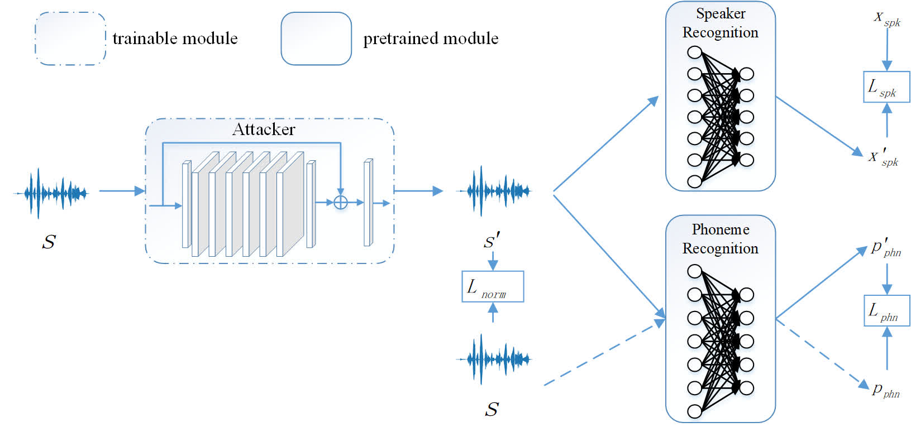

# Learning to Fool the Speaker Recognition

We proposed a lightweight model to attack the speaker recognition model, and we find that the speaker recognition model is vulnerable to the attack. We conduct experiments on TIMIT dataset to demenstrate the efficiency of our model, and our attack achieve high success rate with imperceptible small perturbations.


**You can take a look about our resluts on our [speaker-recognition-attacker](https://smallflyingpig.github.io/speaker-recognition-attacker/main) project home page.**


# Cite us
If you use this code or part of it, please cite us!  
*Jiguo Li, Xinfeng Zhang, Chuanming Jia, Jizheng Xu, Li Zhang, Yue Wang, Siwei Ma, Wen Gao, "learning to fool the speaker recognition"* [arxiv(avaliable soon)]()


# Prerequisites
 - linux
 - python 3.5 (not test on other versions)
 - pytorch 1.2+
 - torchaudio 0.3
 - librosa, pysoundfile
 - json, tqdm, logging

# Update

# Training
The experiments are conducted  on [TIMIT](https://catalog.ldc.upenn.edu/LDC93S1) dataset.

## data preparing
### download dataset and pretrained model
 - you can download TIMIT dataset from the offficial site or [here](https://www.kaggle.com/nltkdata/timitcorpus)
 - download the pretrained speaker recognition model from [here](https://bitbucket.org/mravanelli/sincnet_models/), this model is released by the author of [SincNet](https://github.com/mravanelli/SincNet).
 - download our pretrained phoneme recognition model from [here](google drive). You can refer [Pytorch-kaldi](https://github.com/mravanelli/pytorch-kaldi) if you want to train your own phoneme recognition model.


### prepare the data
 - Run 
```
python ./prepare_dataset.py --data_root PATH_FOR_TIMIT
```
Two csv files and a pickle file will be saved in PATH_FOR_TIMIT/processed.

## training the attacker model
In the project dictionary "learning-to-fool-the-speaker-recignition", run
```
python train_transformer.py --output_dir ./output/attacker_transformer  --speaker_factor 1 --speech_factor 5 --norm_factor 1000 --speech_kld_factor 1 --norm_clip 0.01 --data_root PATH_FOR_TIMIT --speaker_model PATH_FOR_PRETRAINED_SPEAKER_MODEL --speech_model PATH_FOR_PRETRAINED_PBONENE_MODEL --speaker_cfg ./config/timit_speaker_transformer.cfg --no_dist
```
An example of the script:
```
python train_transformer.py --output_dir ./output/timit_non_targeted_trans  --speaker_factor 1 --speech_factor 5 --norm_factor 1000 --speech_kld_factor 1 --data_root /media/ubuntu/Elements/dataset/TIMIT_lower --no_dist --speaker_model ./pretrained/SincNet_TIMIT/model_raw.pkl --speech_model ./pretrained/timit_speech_no_softmax_fixed_augment/epoch_23.pth --speaker_cfg ./config/timit_speaker_transformer.cfg --norm_clip 0.01 --no_dist
```
The training for TIMIT dataset will cost about 1 day on a 1080ti GPU.
## evaluate the model
Run 
```
python train_transformer.py --pt_file PATH_FOR_MODEL --data_root PATH_FOR_TIMIT --speaker_model PATH_FOR_PRETRAINED_SPEAKER_MODEL --speaker_cfg ./config/timit_speaker_transformer.cfg --no_dist --test
```


# project home page
our results, data, pretrained model can be found on our [speaker-recognition-attacker](https://smallflyingpig.github.io/speech-to-image/main) project main page.

# Acknowledgement
Thanks to the valuable discussion with [Jiayi Fu](), [Jing Lin]() and [Junjie Shi](). Besides, thanks to the open source of [SincNet](https://github.com/mravanelli/SincNet), [Pytorch-Kaldi](https://github.com/mravanelli/pytorch-kaldi), [PESQ](https://github.com/vBaiCai/python-pesq).


Please feel free to contact me (jiguo.li@vipl.ict.ac.cn, jgli@pku.edu.cn) if you have any questions about this project. **Note that this This work is only for research. Please do not use it for illegal purposes.**